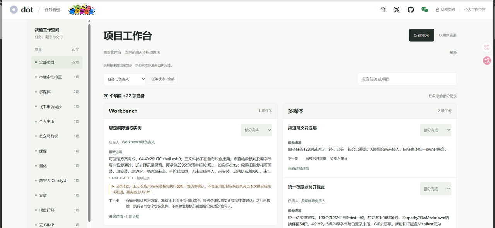
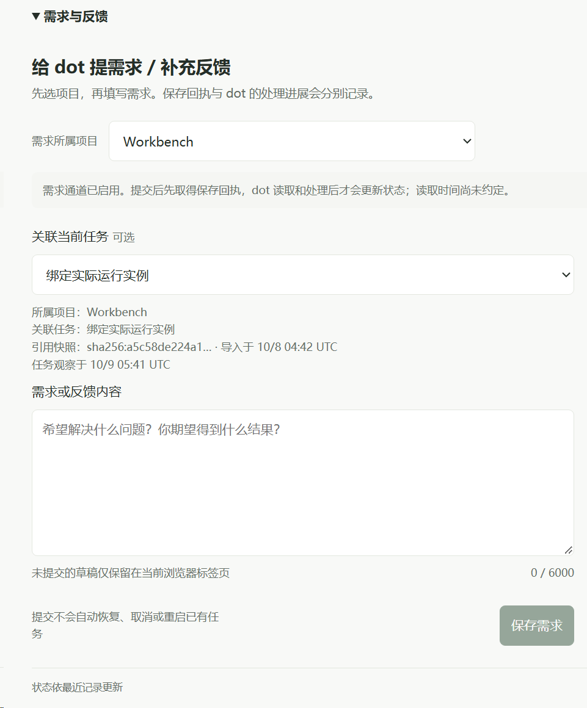
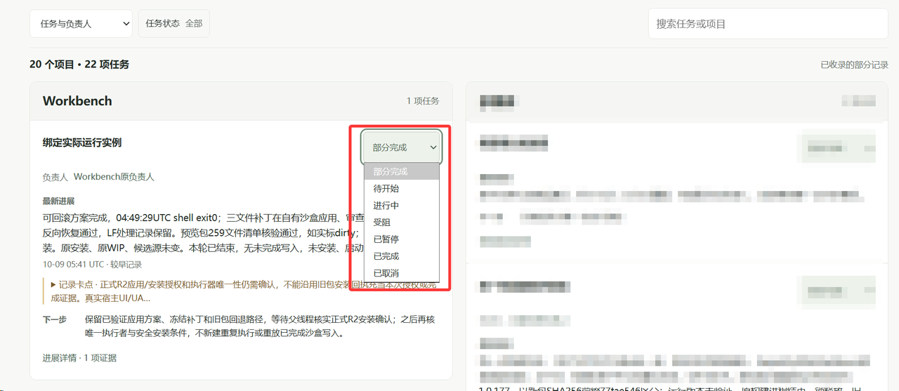

# dot task board

**把每个项目的任务、Agent、阻塞与最近成果，放到同一张看板。**

[English](README.md) · [简体中文](README.zh-CN.md)

[开始使用](#3-步上手) · [给 dot 的部署说明](docs/sites-deployment.zh-CN.md) · [MIT 许可](LICENSE)

## 从这里开始

**把这个 GitHub 地址交给自己的 dot，让它为你部署属于自己的私有在线任务看板。** 完成部署和访问检查后，dot 会给你一个 Site 网址，用浏览器打开即可。你不需要自己执行开发命令。

这张看板可以帮助你查看：

- 每个项目的任务，以及相关 Agent
- 已记录的进展、卡点、下一步和成果证据
- 搜索、筛选和任务详情
- 配置完成后的手动状态修改与备注
- 接通后的需求保存、已读与进展回执

看板展示的是你授权接入的记录，不会自动取得所有对话，也不会因为保存了一条需求就自动启动 Agent。当前界面使用中文。

### 看看实际界面

以下三张为实际使用截图，经维护者确认公开。图中的项目名称、数量和进度是截图时的记录。

#### 1. 按项目看任务和进展

在同一工作台查看任务、负责人、最近进展、卡点和下一步；用项目导航、状态筛选和搜索快速定位。

#### 2. 在对应项目补充需求

选择项目和关联任务，再填写需求或反馈。保存回执与处理进展分别记录，已有需求无需反复重填。

#### 3. 直接调整任务状态

接通手动状态服务后，可在任务卡片上选择状态。手动记录与执行安排分别保留。

### 3 步上手

1. 把 `https://github.com/KimYx0207/dot-task-board` 发给自己的 dot。
2. 复制下面这段话给它。如确实需要平台权限或账号确认，再按提示完成。
3. dot 确认新站部署成功、私有访问检查通过后，打开它给你的网址。先使用示例数据，再接入你自己的获准记录。

**可直接复制给自己的 dot：**

> 读取 https://github.com/KimYx0207/dot-task-board 及 docs/sites-deployment.zh-CN.md，按你当前支持的 Sites 构建和托管流程，为我部署属于自己的、仅我可访问的私有在线任务看板。保留作者四个公开入口：个人主页 aiking.dev、X @KimYx0207、GitHub KimYx0207、微信公众号“老金带你玩AI”。只使用我自己的账号和我授权接入的记录；我的身份、项目数据、对话映射和凭据必须保持私有。按部署文档完成全部配置与访问检查，包括首次安装的只读身份页面。引导我登录并确认自己的站点配置，不要让我猜测或自行查找账号 ID。先用示例数据验证线上页面和仅所有者访问，再给我自己的 Site 网址，简短说明哪些功能可用、哪些还需要配置。若缺少必要的平台功能或权限，准确告诉我缺哪一步。不要把本机预览或尚未验收的自动执行当成在线站点已交付。

### 使用前需要知道

- 你的 dot 和账号需要支持创建、托管私有 Site，以及[部署说明](docs/sites-deployment.zh-CN.md)要求的存储和工具连接能力。
- 过程中可能需要你确认账号权限或部署操作。GitHub 仓库本身不能替你取得平台功能或权限。
- 新看板先使用示例数据，不包含原作者的私有项目、对话或账号。

0.2.0 版支持使用自己的账号和获准记录部署私有在线看板。按部署说明配置存储、身份和所需功能即可开始使用。

### 0.2.0：项目、需求与接续

1. 按项目看任务、负责人、卡点和证据；已取消记录放到归档，过期或缺失观察明确标注。
2. 在原任务编辑目标、完成标准及来源；保存新增需求和已读、进展回执，手动调整状态，配置队列后拖动已入队任务调整顺序。
3. 接入获准的 dot 定时检查，沿原线上任务继续工作；将已保存的需求版本关联到原 native 任务和成果来源。内置会话客户端支持通过宿主工具派发既有请求并回读结果。

接续需要宿主提供定时能力与执行工具；队列执行还需要接通宿主适配器、真实用户许可和经核实的原任务绑定。先安装看板，再按[接入说明](docs/integrations.zh-CN.md)连接所需能力；仓库不会自行安装调度器或取得执行权限。

维护者已实测线上自然定时接续、成果回读及下一轮不重复执行。各提交检查见 [CI](https://github.com/KimYx0207/dot-task-board/actions)，自己的部署按[线上验收清单](docs/sites-deployment.zh-CN.md#5-验收新在线站点)逐项确认。

### 既有需求也能查看和编辑

已有任务的目标、完成标准与新增表单反馈分别展示，空收件箱不代表没有任务需求。配置好完整数据库迁移的所有者私有 Sites，可在原卡编辑目标、完成标准及来源；使用独立版本和幂等保存，保留原任务身份、状态与控制。默认本地预览仅展示。详情见[需求接口及边界](docs/integrations.zh-CN.md#既有任务需求字段)。这些字段不会自行启动任务。

## 保留的四个作者入口

看板顶部保留：

- [个人主页：aiking.dev](https://www.aiking.dev/)
- [X：@KimYx0207](https://x.com/KimYx0207)
- [GitHub：KimYx0207](https://github.com/KimYx0207)
- 微信公众号：**老金带你玩AI**

## 文档导航

普通使用者从上面的复制指令开始即可；dot 按部署文档操作。实现细节和开发命令放在以下专门文档中。

| 文档 | 内容 |
| --- | --- |
| [在线 Site 部署](docs/sites-deployment.zh-CN.md) | 部署并验证自己的私有在线看板 |
| [安装说明](INSTALL.zh-CN.md) | 开发者可选的本机预览与安装 |
| [部署说明](docs/deployment.zh-CN.md) | 托管与访问控制实现 |
| [架构说明](docs/architecture.zh-CN.md) | 程序组件与边界 |
| [数据契约与接口](docs/data-contract.zh-CN.md) | 数据格式与服务接口 |
| [可选接入](docs/integrations.zh-CN.md) | 需求回执与执行接入边界 |
| [参与贡献](CONTRIBUTING.zh-CN.md) | 开发命令与测试要求 |
| [安全说明](SECURITY.zh-CN.md) | 隐私保护与漏洞报告 |
| [更新日志](CHANGELOG.zh-CN.md) | 版本变化 |
| [来源与依赖](THIRD_PARTY.zh-CN.md) | 代码与图片来源 |

## 联系方式

- 微信公众号：**老金带你玩AI**
- 个人微信：扫描联系图中的个人微信二维码，备注“AI”加群
- [飞书知识库：长期更新入口](https://my.feishu.cn/wiki/OhQ8wqntFihcI1kWVDlcNdpznFf)

以上沿用维护者在 [Meta_Kim 联系区](https://github.com/KimYx0207/Meta_Kim/blob/5c77918045d2372a5254b8738bdcfaff468bf4f1/README.zh-CN.md#联系方式)已经公开的联系方式。

普通问题请通过[问题反馈](https://github.com/KimYx0207/dot-task-board/issues)提供示例。漏洞按[安全说明](SECURITY.zh-CN.md)处理，不要公开私有数据或利用细节。

## 许可

[MIT](LICENSE) · Copyright (c) 2026 KimYx0207
